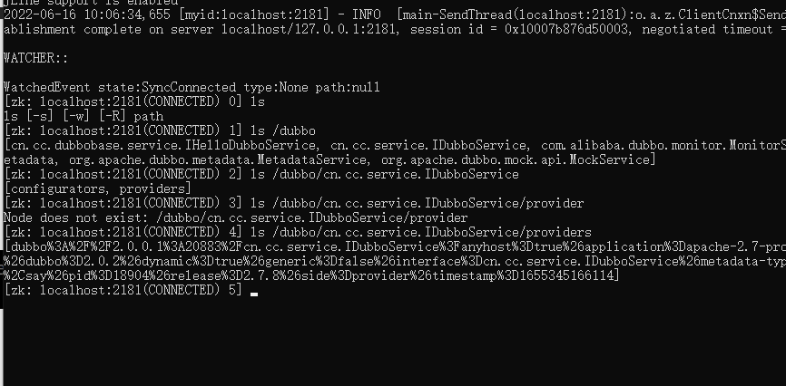

[TOC]

- [参考文档](https://blog.csdn.net/qq_43695957/article/details/122616626)

### 1. zookeeper

~~~
apache-zookeeper-3.8.0-bin
~~~

### 2. pom

~~~
<dependencies>
    <!-- base -->
    <dependency>
        <groupId>cn.cc</groupId>
        <artifactId>apache-2.7-base</artifactId>
        <version>0.0.1-SNAPSHOT</version>
    </dependency>

    <!-- 引入dubbo依赖 -->
    <dependency>
        <groupId>org.apache.dubbo</groupId>
        <artifactId>dubbo-spring-boot-starter</artifactId>
    </dependency>

    <!-- zookeeper依赖 -->
    <dependency>
        <groupId>org.apache.curator</groupId>
        <artifactId>curator-recipes</artifactId>
    </dependency>
    <dependency>
        <groupId>org.apache.curator</groupId>
        <artifactId>curator-framework</artifactId>
    </dependency>
    <!-- zookeeper依赖 -->
</dependencies>
~~~

### 3. code

~~~
// dubbo扫描地址
@EnableDubbo(scanBasePackages = {"cn.cc.apache_dubbo_2_7.service"})
// TODO 扫描配置文件地址
@PropertySource("classpath:/application.yml")
@SpringBootApplication(scanBasePackages = {"cn.cc.apache_dubbo_2_7"})
~~~

### 4. yml

- provider
~~~
server:
  port: 8080
dubbo:
  application:
    name: apache-2.7-provider
    id: apache-2.7-provider
  registry:
    address: zookeeper://127.0.0.1:2181 # 注册中心
  protocol:
    name: dubbo # 几种调用方式吧，应该
    port: 20883
~~~
- consumer
~~~
server:
  port: 8081
dubbo:
  application:
    id: apache-2.7-consumer
    name: apache-2.7-consumer
  registry:
    address: zookeeper://127.0.0.1:2181 # 注册中心
~~~

### 5. 检查zookeeper

- 检查是否注册进去
~~~
ls /dubbo
# 找到写的接口地址
# 然后进去有
[configurators, providers]
# 再进去查看就表示注册成功
~~~

